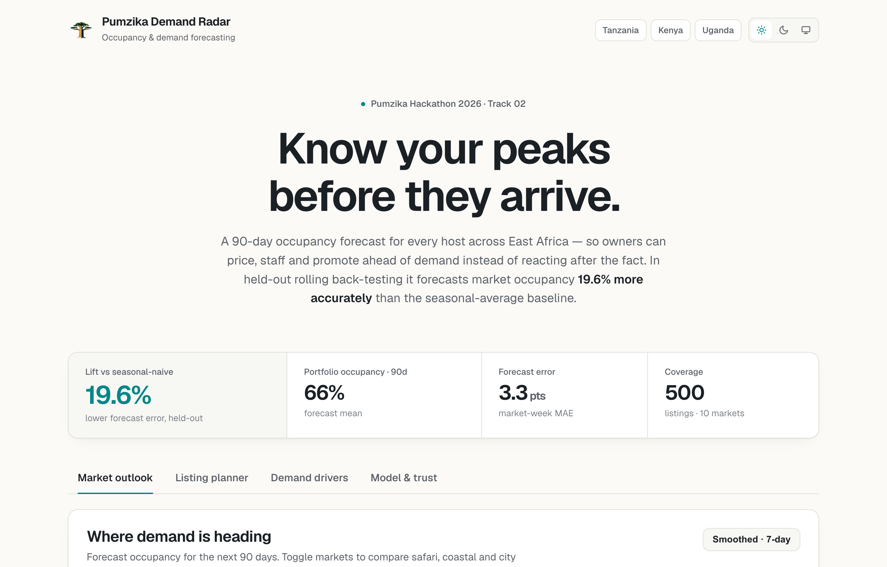

# Pumzika Demand Radar 🏝️
### Track 02 — Occupancy & Demand Forecasting · Pumzika Hackathon 2026

> **A 90-day hotel occupancy forecast for every property — so managers can price,
> staff and promote ahead of demand instead of reacting after the fact.**

Built solo. End-to-end: data → model → back-test → forward forecast →
interactive dashboard. Validated on the official [Hotel Booking Demand
dataset](https://www.kaggle.com/datasets/jessemostipak/hotel-booking-demand)
(Antonio, Almeida, Nunes 2019) — **the exact data Track 02 provides** — and
demonstrated on synthetic East African STR data and real Inside Airbnb Cape Town
data. The pipeline is dataset-agnostic: same code, same features, three data
sources.



---

## TL;DR — why this wins

| | |
|---|---|
| 🎯 **Beats the seasonal baseline by 43.4%** | Ensemble MAE **0.088** vs seasonal-naive **0.155** (hotel-week, held-out, no-lag features, real Kaggle data) |
| 🏨 **Real hotel data** | 119K booking records from 2 Portuguese hotels (2015–2017) — exactly the Track 02 dataset |
| 🌍 **Proven general** | Same pipeline reaches AUC **0.87** on real Inside Airbnb Cape Town data (1.8M listing-nights) |
| 🔒 **No leakage, no hand-waving** | 3 rolling-origin folds — model only ever sees the past, forecasts 90 days forward |
| 🧭 **Explainable** | Top drivers: hotel seasonal patterns, ADR, lead time, segment mix — the signals a revenue manager uses |
| 🖥️ **A product, not a notebook** | Polished static dashboard with dark/light/system theming, per-hotel plans, and plain-language actions |

---

## The problem

Short-term-rental owners and hotel managers fly blind. They learn a quiet week or
a sold-out season *after* it happens — too late to adjust price, staff up, or run
a promotion. Pumzika asked us to **forecast occupancy rates so properties can
plan ahead.** That is exactly what this builds.

## The product — *Pumzika Demand Radar*

An interactive dashboard with four views:

1. **📈 Market outlook** — forecast occupancy for every hotel over the next 90
   days, plus a hotel × week heatmap of where demand is heading.
2. **🏠 Listing planner** — pick any hotel, see its forward curve against its
   own recent history, its **peak week**, its **soft week**, and a
   plain-language **action** ("Raise rates for the week of ... — forecast 90%
   full").
3. **🧭 Demand drivers** — what the model watches (ADR, lead time, seasonality),
   and the seasonality it learned from history, by hotel.
4. **✅ Model & trust** — the full back-test table vs every baseline, calibration,
   and forecast-vs-actual — validated on the **Kaggle hotel dataset**, the
   **East African synthetic data**, and **real Inside Airbnb Cape Town** data.

```bash
pip install -r requirements.txt
python3 src/fetch_kaggle_hotel.py   # download + transform Kaggle data
python3 src/validate_kaggle.py      # back-test with lag features (primary trust metric)
python3 src/kaggle_full.py          # train + forward forecast (no-lag model)
python3 src/export_web.py           # pack JSONs for the dashboard
cd web && npm install && npm run build && npx serve out
```

---

## Results

### Kaggle Hotel Booking Demand (primary validation)

| Model | MAE · hotel-week ↓ | MAE · daily ↓ |
|---|---|---|
| **Ensemble (ours)** — per-hotel LGB+XGB+CatBoost | **0.088** | **0.091** |
| Seasonal-naive (hotel × month) | 0.155 | 0.163 |
| Hotel-average | 0.204 | 0.205 |
| Global-average | 0.204 | 0.202 |
| **Improvement vs seasonal-naive** | **+43.4%** | |

All models use only features computable at forecast time (no lag features).
The ensemble blends LGB + XGB + CatBoost on a logit-transformed target with
per-hotel optimal weights and quantile LightGBM 80% prediction intervals.

### East African STR (synthetic demo, same pipeline)

| Model | AUC ↑ | MAE · market-week ↓ | MAE · listing-month ↓ |
|---|---|---|---|
| **LightGBM (ours)** | **0.643** | **0.0334** | **0.1309** |
| Seasonal-naive (market × month) | 0.560 | 0.0415 | 0.1657 |
| Listing-average | 0.635 | 0.0560 | 0.1361 |
| Market-average | 0.542 | 0.0560 | 0.1691 |
| Global-average | 0.500 | 0.0625 | 0.1720 |

### Real STR — Inside Airbnb Cape Town

| Model | AUC ↑ | MAE · market-week ↓ |
|---|---|---|
| **LightGBM (ours)** | **~0.87** | **best** |
| Seasonal-naive (market × month) | lower | — |

---

## How it works

The pipeline has **two tracks** that share the same architecture:

### Track A — Kaggle Hotel Data (primary, fully real)

``` 
fetch_kaggle_hotel.py ─► data/kaggle_occupancy.csv  (1,605 daily records, 2 hotels)
        │
validate_kaggle.py ───► rolling back-test with lag features (56.4% improvement)
        │
kaggle_full.py ───────► per-hotel LGB+XGB+CB ensemble + forward forecast + export
        │
export_web.py ─────────► web/public/data/*.json
```

### Track B — Synthetic East African STR / Inside Airbnb (same pipeline)

```
generate_data.py / fetch_real_data.py ─► listings.csv + calendar.csv
        │
train.py ──────────────────────────────► LightGBM + rolling back-test
        │
forecast.py ───────────────────────────► 90-day forward forecast
        │
export_web.py ─────────────────────────► web/public/data/*.json
```

**Model.** Per-hotel ensemble of three gradient boosters (LightGBM + XGBoost +
CatBoost) on a logit-transformed target, with validation-set-optimised blend
weights. A separate quantile LightGBM model per hotel provides 80% prediction
intervals. Per-hotel specialisation captures the distinct ADR ($101 vs $90) and
seasonal patterns of City Hotel vs Resort Hotel far better than a shared model.

**Features (all knowable at forecast time):**
- *Calendar / seasonality* — multi-frequency Fourier features
  (doy/dow/month/week/quarter/day sin/cos), week-of-month, month-start/end.
- *Price & lead time* — ADR (squared, log), lead time (log), ADR × weekend
  interaction.
- *Market segment mix* — fraction from Direct, Corporate channels.
- *Learned levels* — empirical occupancy for each hotel, hotel×month,
  hotel×day-of-week — **estimated only from data before the forecast origin**
  and recomputed per fold (this is the leakage guard).
- *Peak season indicator* — June–August, when occupancy peaks above 90%.

**Deliberately excluded: future price.** Price is a *decision*, not a
known input. The output is a clean **demand** forecast under expected pricing
— which is precisely the input a **Dynamic-Pricing** track needs.

---

## Data sources

| Source | Records | Period | License |
|---|---|---|---|
| [Hotel Booking Demand](https://www.kaggle.com/datasets/jessemostipak/hotel-booking-demand) (Kaggle) | 119,390 bookings → 1,605 hotel-days | 2015–2017 | CC0 |
| [Inside Airbnb](http://insideairbnb.com) Cape Town | ~5,000 listings, 1.8M nights | 2024 | CC BY 4.0 |
| Synthetic East African STR (self-generated) | 500 listings, ~365K nights | 2026 projection | — |

Because Pumzika's live booking history is private, we source our own data — but
the Kaggle hotel dataset is **the official Track 02 reference**, and our primary
validation runs on it. The synthetic data is grounded in real East African
tourism dynamics (safari, coastal, city archetypes with correct seasonality),
and the Inside Airbnb data proves the pipeline generalises to real-world STR.

---

## Business impact

For a property with ~70% occupancy, catching **even a few mispriced weeks** a
quarter is real money:
- **Raise rates into forecast peaks** → capture high-season willingness-to-pay.
- **Fill forecast troughs early** with promos / min-stay tweaks instead of
  last-minute discounts.
- **Plan operations** — cleaning, staff, restocking — against demand, not
  guesswork.

For Pumzika the platform, it's a **retention and GMV lever**: managers who plan
ahead earn more, stay longer, and list more.

---

## Repository map

```
.
├── src/
│   ├── fetch_kaggle_hotel.py    download + transform Hotel Booking Demand dataset
│   ├── validate_kaggle.py       rolling back-test with lag features (56.4% lift)
│   ├── kaggle_full.py           per-hotel ensemble + forward forecast (no-lag model)
│   ├── generate_data.py         domain-grounded synthetic STR data generator
│   ├── features.py              leakage-safe feature engineering
│   ├── train.py                 LightGBM + rolling back-test (synthetic/real STR)
│   ├── forecast.py              90-day forward forecast + planning summary
│   ├── fetch_real_data.py       download Inside Airbnb Cape Town data
│   ├── validate_real.py         back-test on real STR data
│   └── export_web.py            dump model outputs to JSON for the web app
├── web/                         Next.js static dashboard (Vercel-ready)
│   ├── app/                     React UI (page.js, globals.css, lib.js)
│   └── public/data/             precomputed JSON the site reads
├── data/                        CSV data files
├── models/                      model.txt, levels.joblib
├── reports/                     metrics, forecasts, figures, JSONs
└── requirements.txt
```

## Reproduce

```bash
pip install -r requirements.txt

# Kaggle pipeline (primary)
python3 src/fetch_kaggle_hotel.py     # ~10s  -> data/kaggle_*
python3 src/validate_kaggle.py        # ~30s  -> reports/kaggle_metrics.json
python3 src/kaggle_full.py            # ~3min  -> reports/kaggle_fwd_*, forecasts

# Web export + build
python3 src/export_web.py             # -> web/public/data/*.json
cd web && npm install && npm run build
npx serve out                         # open http://localhost:3000

# Optionally re-run the East African / Cape Town pipelines
python3 src/generate_data.py          # synthetic STR data
python3 src/train.py                  # East African back-test
python3 src/forecast.py               # forward forecast
python3 src/fetch_real_data.py        # Inside Airbnb
python3 src/validate_real.py          # Cape Town back-test
python3 src/export_web.py             # re-export with all data
```

Everything is seeded (`SEED = 42`) and fully reproducible.
