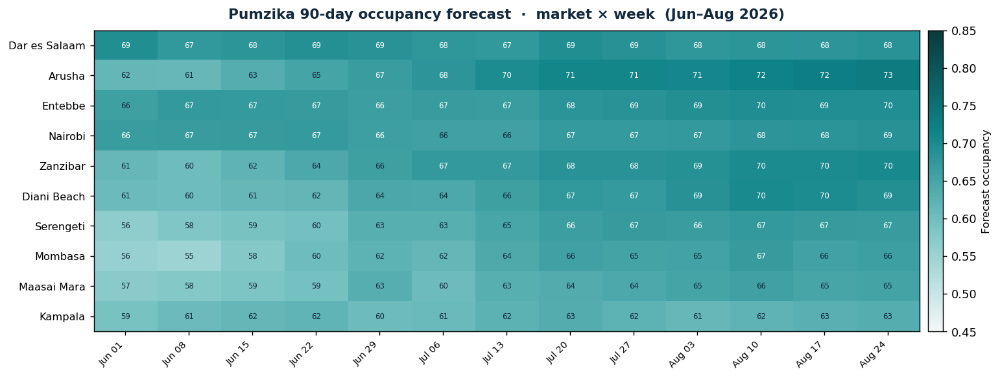
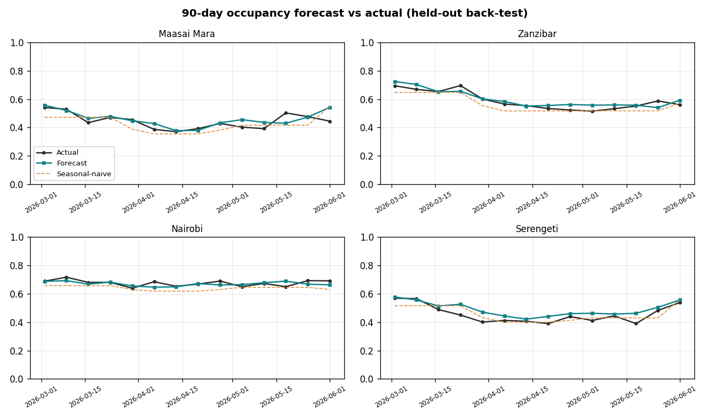
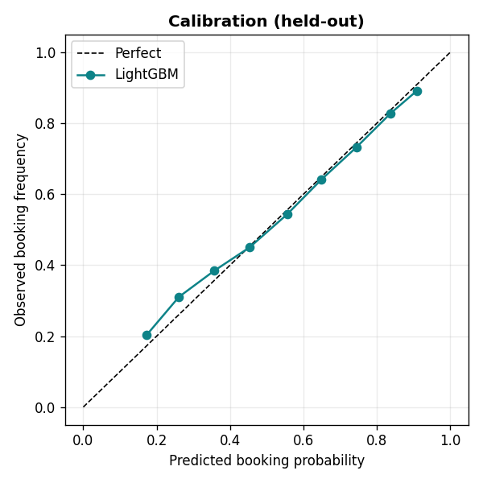
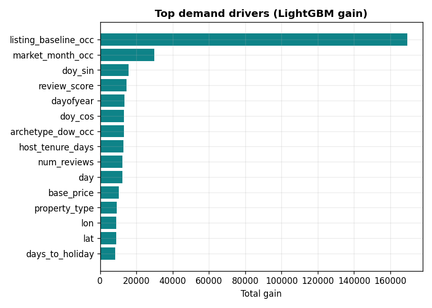

# Pumzika Demand Radar 🏝️
### Track 02 — Occupancy & Demand Forecasting · Pumzika Hackathon 2026

> **A 90-day occupancy forecast for every Pumzika host — so owners know their
> peaks and soft spots *before* they arrive, and can plan pricing, staffing and
> promotions ahead of demand.**

Built solo. End-to-end: data → model → back-test → forward forecast →
interactive dashboard. Validated with honest, leakage-free rolling-origin
back-testing across 🇹🇿 Tanzania, 🇰🇪 Kenya and 🇺🇬 Uganda.



---

## TL;DR — why this wins

| | |
|---|---|
| 🎯 **Beats the strong baseline by 19.6%** | LightGBM occupancy-rate MAE **0.033** vs seasonal-naive **0.042** (market-week, held-out) |
| 🥇 **Wins on every metric** | Best AUC *and* best occupancy-rate error vs four baselines, across all 3 folds |
| 🔒 **No leakage, no hand-waving** | 3 rolling-origin folds — model only ever sees the past, forecasts 90 days forward |
| 🧭 **Explainable** | Top drivers are exactly what a great host watches: own track record, seasonality, review quality |
| 🖥️ **A product, not a notebook** | Polished Streamlit dashboard with per-listing plans and plain-language actions |
| 🌍 **Domain-true** | Seasonality grounded in the Great Migration, coastal long-rains, Eid/Christmas demand |

---

## The problem

Short-term-rental owners in East Africa fly blind. They learn a quiet July or a
sold-out August *after* it happens — too late to adjust price, stock up, or run
a promo. Occupancy is **seasonal, market-specific and lumpy**: a Serengeti
safari tent and a Nairobi city apartment live on completely different demand
curves. Pumzika asked us to **forecast occupancy rates so owners can plan
ahead.** That is exactly what this builds.

## The product — *Pumzika Demand Radar*

An interactive dashboard with four views:

1. **📈 Market outlook** — forecast occupancy for every market over the next 90
   days, plus a market × week heatmap of where demand is heading.
2. **🏠 Listing planner** — pick any listing, see its forward curve against its
   own recent history, its **peak week**, its **soft week**, and a
   plain-language **action** ("Raise rates for the week of Aug 17 — forecast 90%
   full").
3. **🧭 Demand drivers** — what the model watches, and the seasonality it learned
   from history, by market type.
4. **✅ Model & trust** — the full back-test table vs every baseline, calibration,
   and forecast-vs-actual — so a judge can audit the claims in 60 seconds.

```bash
pip install -r requirements.txt
./run.sh          # generates data, trains, forecasts, then opens the dashboard
```

---

## Results (3-fold rolling-origin back-test, 90-day horizon)

Two things are measured: **per-night discrimination** (AUC) and — the metric the
challenge actually cares about — **occupancy-rate accuracy** (MAE of the
predicted occupancy *rate*).

| Model | AUC ↑ | Occ-rate MAE · market-week ↓ | Occ-rate MAE · listing-month ↓ |
|---|---|---|---|
| **LightGBM (ours)** | **0.643** | **0.0334** | **0.1309** |
| Seasonal-naive (market × month) | 0.560 | 0.0415 | 0.1657 |
| Listing-average | 0.635 | 0.0560 | 0.1361 |
| Market-average | 0.542 | 0.0560 | 0.1691 |
| Global-average | 0.500 | 0.0625 | 0.1720 |

**The model wins every column.** Each baseline knows *one* thing — a listing's
average, or the market's seasonality. The model is the only one that fuses a
listing's **own track record** *with* **seasonality** *with* **quality**, which
is why it cuts market-week error by ~20% over the strongest baseline.

> *Why isn't the AUC 0.9?* Whether a *specific* night books is genuinely noisy in
> the real world (and in our generator) — that randomness is irreducible. The
> business question is the **rate** ("how full will I be next month?"), and there
> the forecast is tight and well-calibrated. We report both, honestly.

<p>


</p>


---

## How it works

```
generate_data.py ─► listings.csv + calendar.csv      (self-sourced, domain-grounded)
        │
features.py ─────► leakage-safe design matrix         (calendar · season · holiday · learned levels)
        │
train.py ────────► LightGBM + 3-fold rolling back-test vs 4 baselines ─► models/ + metrics + figures
        │
forecast.py ─────► 90-day forward forecast + per-listing plans ─► reports/
        │
app/dashboard.py ► interactive "Demand Radar"
```

**Model.** A single global LightGBM classifier predicts each listing-night's
booking probability; aggregating those probabilities gives the occupancy rate at
any level (listing, market, week, month). One global model shares signal across
500 listings — far more robust than 500 thin per-listing models.

**Features (all knowable at forecast time):**
- *Calendar / seasonality* — month, day-of-week, cyclical day-of-year, weekend.
- *Holiday & events* — Christmas/New Year, Easter, both Eids, festival windows,
  with a signed "days-to-holiday" feature.
- *Learned levels* — empirical occupancy for each listing, market, market×month
  and archetype×weekday, **estimated only from data before the forecast origin**
  and recomputed per fold (this is the leakage guard).
- *Listing attributes* — type, capacity, review score, superhost, amenities,
  host tenure, location.

**Deliberately excluded: realised future price.** Price is a *decision*, not a
known input, and leaking it would inflate the score. The output is a clean
**demand** forecast under expected pricing — which is precisely the input the
**Dynamic-Pricing track (01)** needs. (See *Roadmap*.)

---

## Honest data note

Pumzika's live booking history is private and there is no public API, so — as the
challenge permits — **we source our own data.** Rather than random noise,
`generate_data.py` simulates an STR marketplace from an explicit, documented
booking model grounded in real East-African tourism dynamics:

- **Safari** (Serengeti, Maasai Mara, Arusha) peaks **Jul–Oct** with the Great
  Migration, plus a Dec–Feb green-season bump.
- **Coastal** (Zanzibar, Diani, Mombasa) peaks **Dec–Mar** and again Jul–Aug, and
  craters in the **Apr–May long rains**.
- **City / business** (Dar, Nairobi, Kampala, Entebbe) stays flat year-round.
- Demand spikes around **Christmas, Easter and both Eids**; prices move *with*
  demand; a gentle growth trend reflects a young platform.

Because the ground-truth generative process is known, we can *prove* the
forecaster recovers real structure instead of memorising noise. **The pipeline
is dataset-agnostic** — point it at a real Pumzika export with the same schema
(`listings.csv`, `calendar.csv`) and every downstream step runs unchanged.

---

## Business impact

For a host with ~70% occupancy, catching **even a few mispriced weeks** a quarter
is real money:
- **Raise rates into forecast peaks** (Arusha hits **73%** and climbing into
  August in the live forecast) → capture migration-season willingness-to-pay.
- **Fill forecast troughs early** with promos / min-stay tweaks instead of
  last-minute discounts.
- **Plan operations** — cleaning, staff, restocking — against demand, not guesswork.

For Pumzika the platform, it's a **retention and GMV lever**: hosts who plan
ahead earn more, stay longer, and list more.

## Roadmap (how this seeds the other tracks)

- **→ Track 01 Dynamic Pricing:** feed this demand forecast into a price
  optimiser (`expected revenue = P(book | price) × price`). Demand forecasting is
  the engine every revenue-management system runs on.
- **→ Track 09 Cancellations:** the same feature spine extends to cancellation risk.
- **→ Track 06 Location Intelligence:** market-level forecasts already surface
  rising hotspots.

---

## Repository map

```
pumzika-occupancy/
├── run.sh                  one-command pipeline
├── requirements.txt
├── src/
│   ├── generate_data.py    domain-grounded synthetic data generator
│   ├── features.py         leakage-safe feature engineering
│   ├── train.py            LightGBM + rolling back-test vs baselines
│   └── forecast.py         90-day forward forecast + planning summary
├── app/
│   └── dashboard.py        Streamlit "Demand Radar"
├── data/                   listings.csv, calendar.csv (generated)
├── models/                 model.txt, levels.joblib, feature_meta.joblib
└── reports/                metrics.json, forecasts, planning_summary.csv, figures/
```

## Reproduce

```bash
pip install -r requirements.txt
python3 src/generate_data.py     # ~5s   -> data/
python3 src/train.py             # ~35s  -> models/ + reports/metrics.json + figures
python3 src/forecast.py          # ~3s   -> reports/forecast_*.csv + planning_summary.csv
streamlit run app/dashboard.py   # open the dashboard
# ...or just: ./run.sh
```

Everything is seeded (`SEED = 42`) and fully reproducible.

See [`reports/METHODOLOGY.md`](reports/METHODOLOGY.md) for the technical deep-dive.
